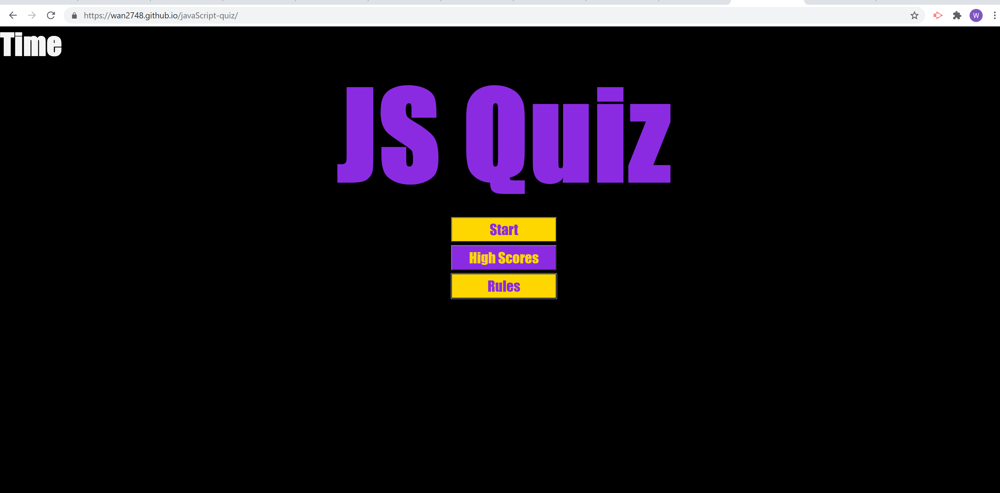
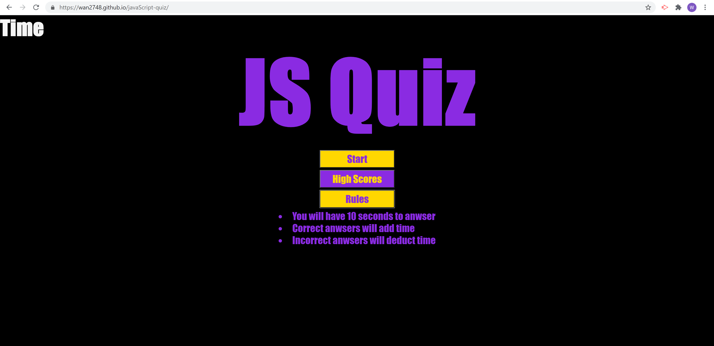

# javaScript-quiz
This quiz is use to excercise using javaScript. 

## Overview 
* I had to review the course repo for help on sturcture.
* W3schools came to help with reminders on some writing 
* i had watched a youtube video for help getting started [youtube](https://www.youtube.com/watch?v=f4fB9Xg2JEY&t=2082s) this video showed me direction and I use some styling for the page. I also used the anchor tag idea from here for the highscore page.

### screenshots

* [sitelink](https://wan2748.github.io/javaScript-quiz/)